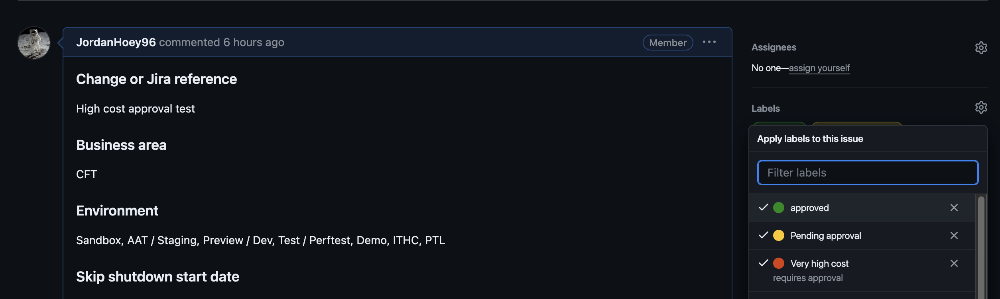

# aks-auto-shutdown
Config for Auto-Shutdown/Start of the AKS clusters

In the near future, all environments excluding Production will be automatically shutdown. This action is to reduce the unnecessary infrastructure costs while the environments are not in use.

## Default cluster shutdown hours

20:00 to 06:30 everyday of the week.

## Skip shutdown functionality

In the event that an environment or environments are needed outside of the default hours, you can raise an "issue" to automatically exclude it from the shutdown schedule.
- [Complete this issue form](https://github.com/hmcts/auto-shutdown/issues/new?assignees=&labels=&projects=&template=3-skip-auto-shutdown-request.yaml).
- Multiple environments within the same "Business area" can be selected at the same time.
- "Cross-Cutting" = Shared Services
- Enter the "start date" for when automatic shutdown skips should begin.
- If available, enter an end date for when your desired enviornment nolonger needs to be skipped from the automatic shutdown schedule.
- If no end date is provided, it will default to the same day as the start date.
- Select "Yes" or "No" from the dropdown menu to indicate if the requested envitonment can be shutdown at 23:00. Default is No.
- Select "Submit new issue"
- Wait for form processing to complete (~5 seconds) - you will see feedback comments if there are errors or when processing is complete.
    - In the event you need to edit your issue due to an error (unexpected date format error).
    - You can select the three dots (...) followed by "Edit"
    - Make your change
    - Select "Update comment"
    - Processing checks will automatically restart.
- Issue will automatically close
- Review [shutdown exclusions json](https://github.com/hmcts/aks-auto-shutdown/blob/master/issues_list.json)

## Shutdown exclusion request - review process

All shutdown requests are now subject to an approval process, primarily based on the associated additional cost of running clusters for longer.

Any requests under an estimated value of £5,000 will be auto approved. Anything higher will require an approval from someone other than the requester.

It is important to monitor the comment section of the request (GitHub issue), the automated process will provide feedback in these comments including:

- Associated cost of request in £
- Errors in form submission or cost processing
- Approval status

### Who can approve requests?

Currently, anyone other than the requester can be an approver. The main purpose of this approval system is to sanity check that requests are not excessive.

### What is the approval guidance?

Requests should only be approved when the shutdown exclusion is necessary and for the appropriate amount of time.

You should check:
- Request has an appropriate Change or Jira reference ID
- The start and end dates of the request are the minimum required, see below example.
- Only the necessary enviornments have been included in the request. Note: If you need AAT / Staging then you may want to also select PTL for Jenkins and Preview / Dev if you need to do a pull request

Examples:
- An exclusion is needed for an out of hours release on 20th March 2024.

In this example, the shutdown start date should be 20-03-2024 with an end date of 20-03-2024. Tip: Leaving the end date blank will default the end date to the same as the start date.

### How is an approval added?

A request can be approved by adding the "approved" label to the request.

A request can be denied by adding the "denied" label to the request. This will automatically close the ticket.

## Cancelling a shutdown or startup

If you have raised an issue to get an exclusion and this is no longer required, you can cancel it.

To cancel it, simply add the `cancel` label to the original issue.

A github action will run to remove the issue from the json so the original exclusion you raised will not proceed.

## Testing changes to this repo

If you wish to test changes to the repo, create a pull request. An action will run to create a test issue for you and it will process that test issue.

The issue will be named for your PR e.g. PR-100.

The action will search for issues based on the title so do not change this or create another issue with the same name.

A test notification will be sent to Slack channel: `auto-shutdown-test`. If you wish to be added to this channel, reach out to the PlatOps team.

The issue may get closed but this is expected. The same issue will be reused on subsequent runs so you don't need to open a new one. You can manually reopen the test issue if you need to test a change that will close the issue.

You can update the action to test different scenarios such as having a longer skip period if you need to test very high cost skips.

Just update the [values](.github/workflows/parsegithubissue-pr.yaml#L31-L45) as appropriate

## Diagrams

Diagrams can be added to help understand the logic of the shutdown/startup scripts.

These should be written in [UML](https://www.visual-paradigm.com/guide/uml-unified-modeling-language/what-is-uml/) which are diagrams written in code, specifically using [PlantUML](https://plantuml.com/).

If you are using VSCode you can install the PlantUML [plugin](https://marketplace.visualstudio.com/items?itemName=jebbs.plantuml) which will allow you to preview the diagrams locally and view changes in realtime.

Example of the VSCode plugin and preview:

An export of the diagram is also kept alongside the `.puml` file which contains the code.

This makes it easier to view the diagram within GitHub without the need for the plugin or a rendering server.
